# Naver Login
## 일반적인 로그인
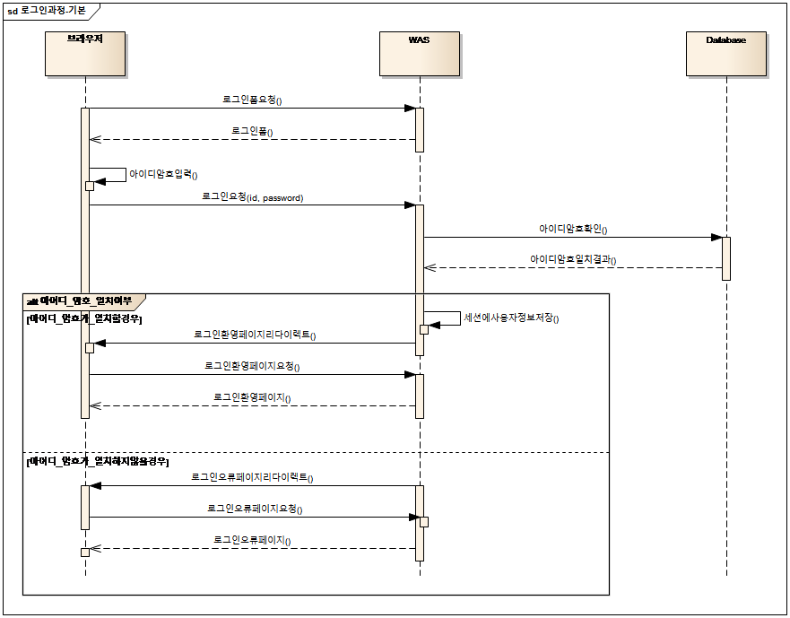

- 보통 웹 어플리케이션은 로그인 폼을 제공한 후, 사용자가 id,암호를 올바르게 입력하였다면 세션에 로그인 정보를 저장하고 로그인 성공 화면을 보여준다.
-	로그인한 사용자만 이용할 수 있는 URL에서는 세션에 올바른 값이 있는지 비교를 하게 된다.


## 네이버 로그인
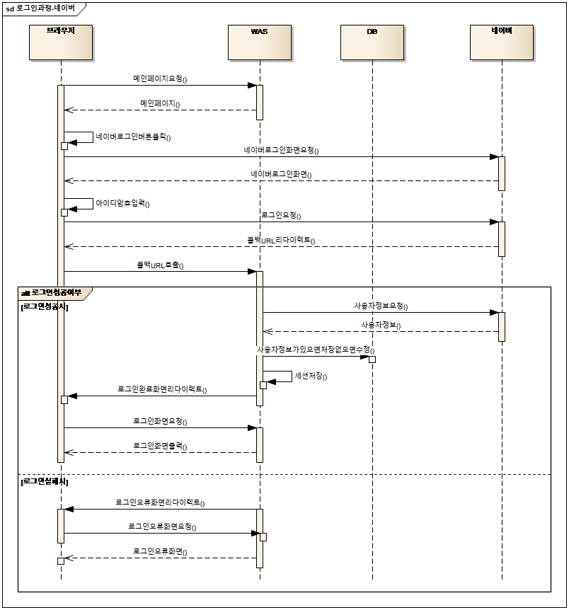


## Naver에서 애플리케이션 등록

1. https://developers.naver.com/apps/#/list 에서 Application 등록버튼 클릭

2. 애플리케이션 정보 등록

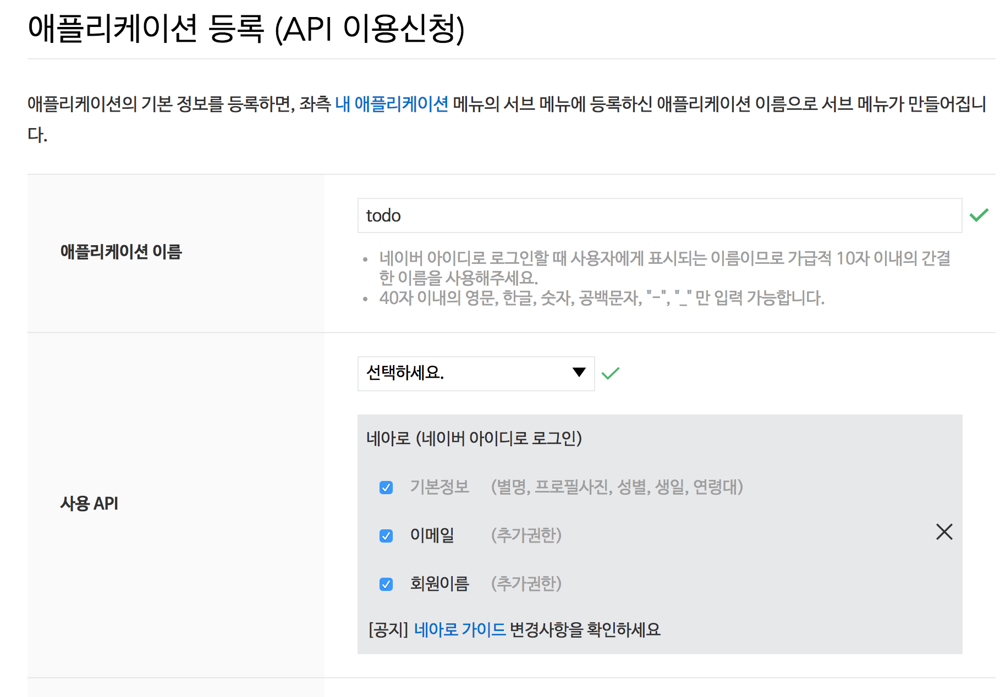
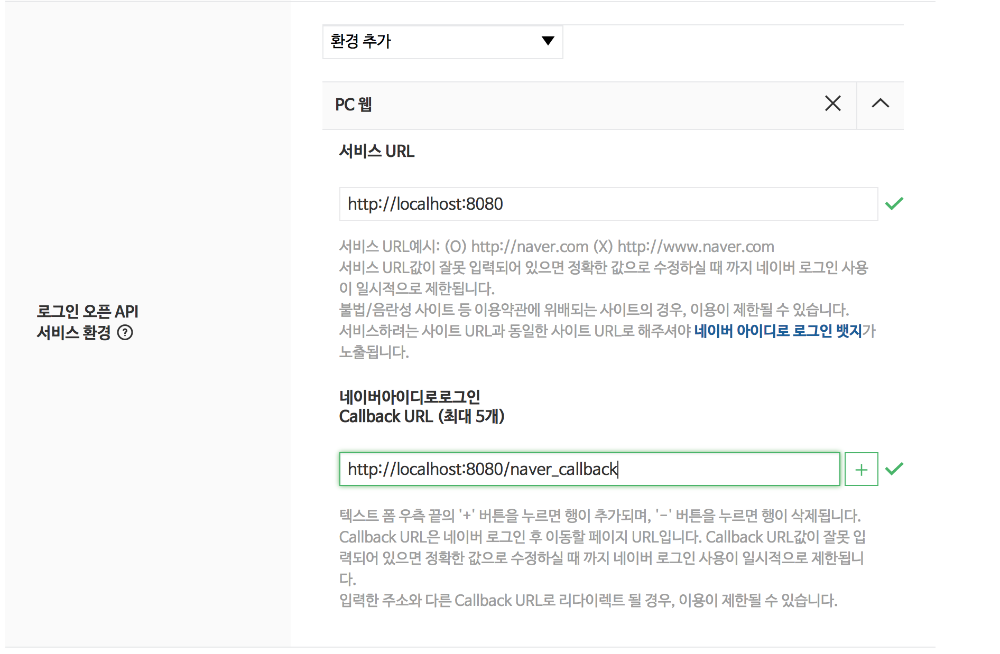
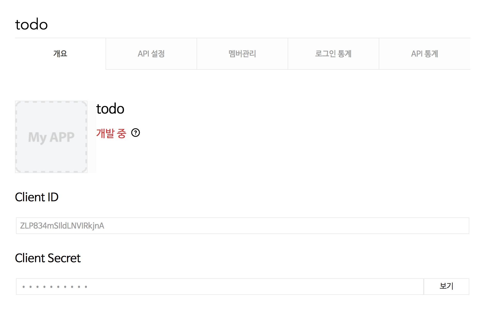

3. 로그인, 사용자 정보등을 가지고 오기 위해서 Naver 문서를 참조한다

https://developers.naver.com/docs/login/devguide/

예제>
https://nid.naver.com/oauth2.0/authorize?response_type=code&client_id=CLIENT_ID&state=STATE_STRING&redirect_uri=CALLBACK_URL

로그인 버튼을 누르면 위의 URL로 요청이 간다.

- 네이버에 로그을을 하지 않은 상황이라면 todo 를 사용하려면 로그인 해야합니다 라는 메시지와 함께 id, password입력창이 보여진다. 아이디, 암호를 입력하여 로그인을 하면 todo앱에 어떤 정보를 제공하는지 보여준다.
  "동의하기"버튼을 클릭하게 되면 callback URL로 redirect하게 된다

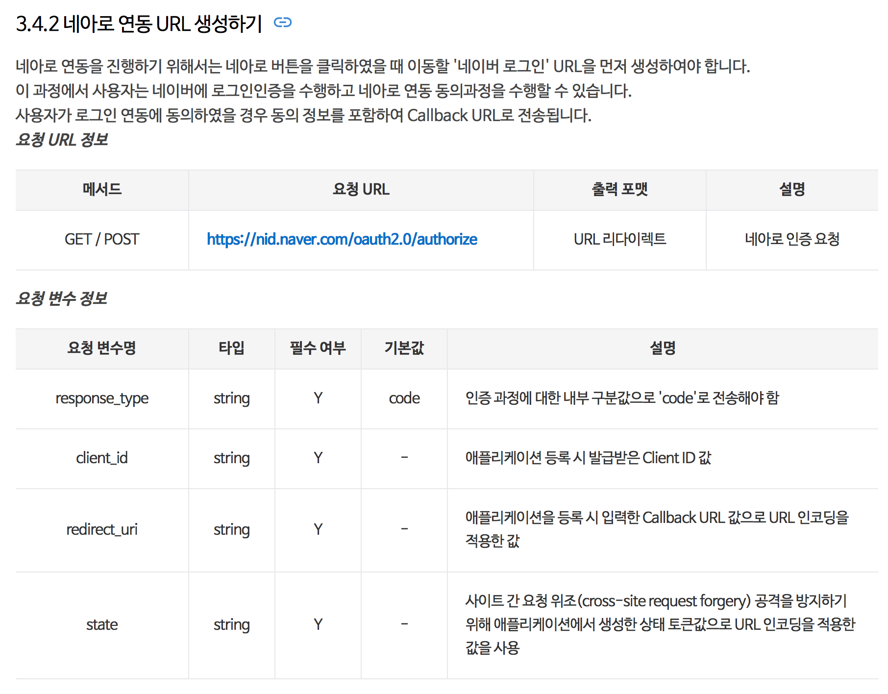
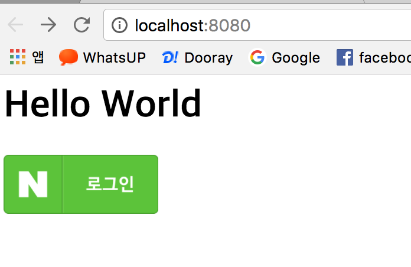
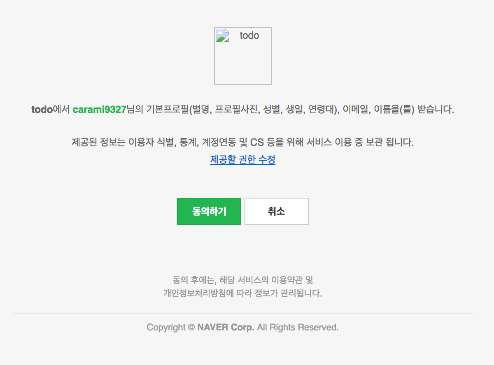

- callBack으로 넘어온 정보를 출력하면 다음과 같다. 제대로 넘어왔는지 확인하기 위하여 Session에 저장해둔 state값과 파라미터로 넘어온 State값을 비교한다.
- code값은 네아로 인증에 성공하면 반환받는 인증 코드, 접근 토큰(access token) 발급에 사용됩니다.
```
Header Values ----------------------------------
host : localhost:8080
connection : keep-alive
cache-control : max-age=0
upgrade-insecure-requests : 1
user-agent : Mozilla/5.0 (Macintosh; Intel Mac OS X 10_12_5) AppleWebKit/537.36 (KHTML, like Gecko) Chrome/59.0.3071.115 Safari/537.36
accept : text/html,application/xhtml+xml,application/xml;q=0.9,image/webp,image/apng,*/*;q=0.8
accept-encoding : gzip, deflate, br
accept-language : ko,en-US;q=0.8,en;q=0.6
cookie : Idea-6296546d=26b39535-a7fb-4ddc-8989-f3f7b4b66bb9; SCOUTER=xs2ri0r5003jj; JSESSIONID=8B1C39C006177C355F532784D661C3E5

request Values ----------------------------------
code : v2p7b2jcu30CmeJ1
state : 916882313730767219999586828602446552295
```

4. 네이버 로그인URL 구하기.  

- https://nid.naver.com/oauth2.0/authorize?response_type=code&client_id=CLIENT_ID&state=STATE_STRING&redirect_uri=CALLBACK_URL  
- 이런 형태의 URL을 생성하려면 어떻게 해야할까??

- redirect_uri=CALLBACK_URL   : 네이버 앱 등록할 때 입력한 URL
- client_id=CLIENT_ID  : 네이버 앱 등록할 때 부여된 ID
- state=STATE_STRING   : 랜덤하게 생성한 값.  
- state 값은 session에 저장해야한다.  추후에 redirect_url에 파라미터로 넘어온 값과 비교하여 해당 url이 올바른지 검증하는 목적으로 사용된다.

5. 콜백 URL
- 네이버로 로그인 요청하면, 로그인 처리 한 후에 요청할 때 보냈던 CALLBACK_URL로 redirect된다.
- 이때 code, state 값이 파라미터로 넘어오는 것을 알 수 있다. 2가지 값을 callback_url에서 확인해야한다.

6. callback이 올바른지 확인하고 사용자 정보 읽어오기.
- 네이버 로그인URL 구할때 생성해서 session에 저장해 둔 값과 callback 정보에서 얻어온 값이 일치하는지 확인한다.

- 네이버에서 회원정보를 읽어오려면, 인증 후에 token을 발급받아야 합니다. URL객체나 RestTemplate을 이용
- 네이버로부터 Token을 받은 후에, 해당 Token을 이용하여 네이버 사용자 정보 api를 읽어와야 합니다.


- 네이버에서 회원정보를 읽어오려면, 인증 후에 token을 발급받아야 합니다. URL객체나 RestTemplate을 이용
- 네이버로부터 Token을 받은 후에, 해당 Token을 이용하여 네이버 사용자 정보 api를 읽어와야 합니다.


    - RestTemplate등록하기
      - RootApplicationContextConfig 에 RestTemplate 객체를 등록
      - RestTemplate객체는 rest api를 호출한 후, 그 결과값을 객체로 자동변환하는 기능을 가지고 있다.
      - 보통 rest api는 json, xml 등의 결과를 반환. 혹은 byte배열이 전달 될 수도 있다. 이러한 다양한 결과를 변환하는 Converter를 설정한다.
      - 이때 등록한 RestTemplate은 Controller에서 주입받아 사용한다.  


- 토큰을 얻을때는 callback으로 받은 code값과 시크릿값이 필요하다. 이 시크릿 값이 유출이 되면 마치 내가 만든 앱이 요청한 것처럼 동작하는 코드를 만들수 있으니 유출되지 않도록 조심해야 한다.. 네이버에서도 기본은 ***** 으로 보여지고 있다.

```
ResponseEntity<Map<String, String>> responseEntity = restTemplate.exchange(urlBuilder.toString(), HttpMethod.GET, httpEntity, new ParameterizedTypeReference<Map<String,String>>(){});
```            
위의 코드가 restTemplate을 이용하여 api를 호출한 후 그 결과값을 받는 예제이다. 응답결과를 Map형태로 받는 것을 알 수 있다.

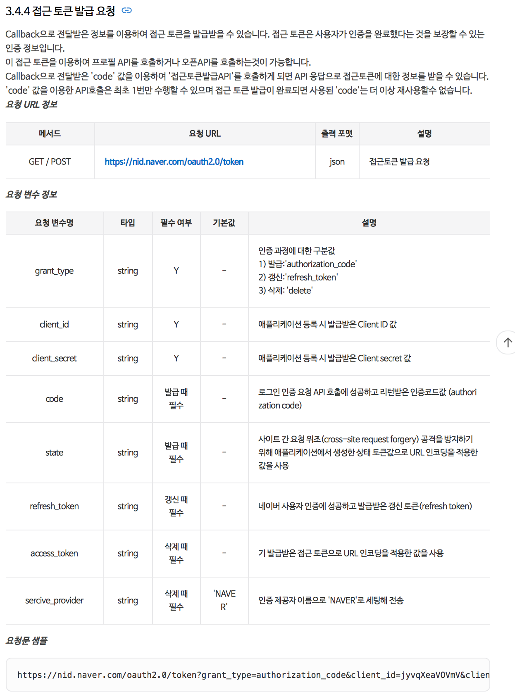
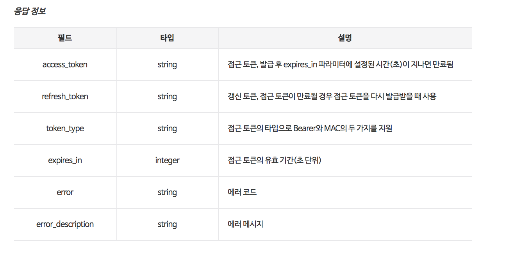        

api의 응답 결과에 있는 access_token, refresh_token 등이 넘어오는 것을 알 수 있습니다.

- token을 얻었다면, 해당 token을 이용하여 사용자 정보를 읽어옵니다.getNaverLoginUser() 메소드는 사용자 정보를 읽어옵니다.

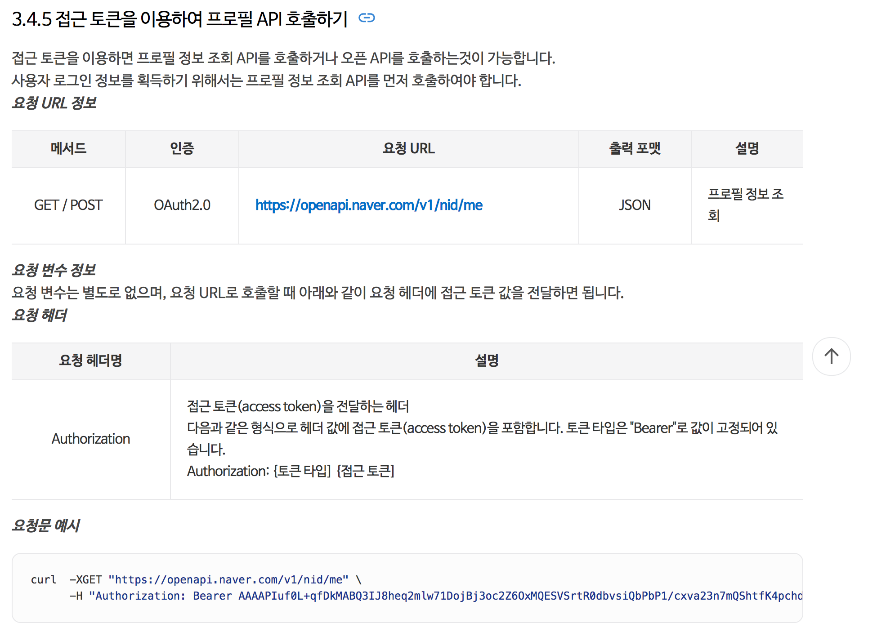
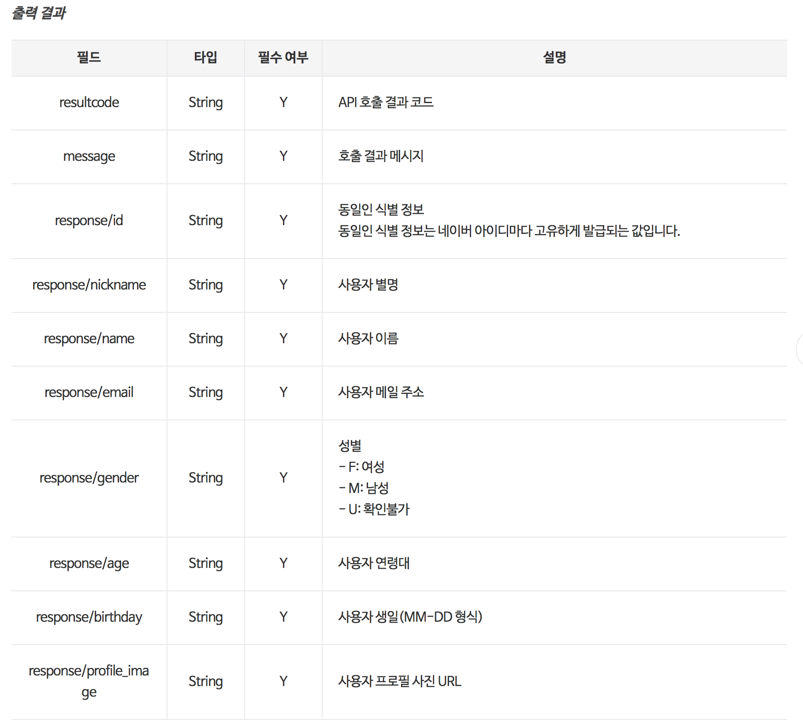     

```
ResponseEntity<NaverLoginUserResult> responseEntity = restTemplate.exchange(urlBuilder.toString(), HttpMethod.GET, httpEntity, new ParameterizedTypeReference<NaverLoginUserResult>(){});
NaverLoginUser response = responseEntity.getBody().getResponse();
```
위의 코드는 RestTemplate을 이용하여 Naver사용자 정보를 읽어온다. naver api는 json형태로 값을 반환한다.
api문서를 보면 해당 json값을 객체로 변환시키기 위해서 NaverLoginUserResult와 NaverLoginUser객체를 만들었다.


- 네이버 사용자 정보를 저장하기 위해 NaverLoginUserResult 객체 생성.
- NaverLoginUserResult는 api를 성공적으로 읽었는지에 대한 정보(resultCode, message)와 실제 회원 정보를 가지고 있다.
- 실제 회원정보는 NaverLoginUser객체에 담겨져 있다.

실제로 로그인을 한 이후 가지고 온 결과값은 다음과 같습니다.

```
NaverLoginUser{email='carami9327@naver.com', nickname='별이엄마', profileImage='https://ssl.pstatic.net/static/pwe/address/img_profile.png', age='40-49', gender='F', id='8070696', name='강경미', birthday='11-04'}
```

```
package carami.todo.dto;

/**
 * Created by 강경미 on 2017. 4. 23..
 */
public class NaverLoginUserResult {
    private String resultCode;
    private String message;
    private NaverLoginUser response;

    public String getResultCode() {
        return resultCode;
    }

    public void setResultCode(String resultCode) {
        this.resultCode = resultCode;
    }

    public String getMessage() {
        return message;
    }

    public void setMessage(String message) {
        this.message = message;
    }

    public NaverLoginUser getResponse() {
        return response;
    }

    public void setResponse(NaverLoginUser response) {
        this.response = response;
    }
}


```

```
package carami.todo.dto;

import com.fasterxml.jackson.annotation.JsonProperty;

import java.io.Serializable;

/**
 * Created by 강경미 on 2017. 4. 23..
 */
public class NaverLoginUser implements Serializable{
    private String email;
    private String nickname;
    @JsonProperty("profile_image")
    private String profileImage;
    private String age;
    private String gender;
    private String id;
    private String name;
    private String birthday;

    public String getEmail() {
        return email;
    }

    public void setEmail(String email) {
        this.email = email;
    }

    public String getNickname() {
        return nickname;
    }

    public void setNickname(String nickname) {
        this.nickname = nickname;
    }

    public String getProfileImage() {
        return profileImage;
    }

    public void setProfileImage(String profileImage) {
        this.profileImage = profileImage;
    }

    public String getAge() {
        return age;
    }

    public void setAge(String age) {
        this.age = age;
    }

    public String getGender() {
        return gender;
    }

    public void setGender(String gender) {
        this.gender = gender;
    }

    public String getId() {
        return id;
    }

    public void setId(String id) {
        this.id = id;
    }

    public String getName() {
        return name;
    }

    public void setName(String name) {
        this.name = name;
    }

    public String getBirthday() {
        return birthday;
    }

    public void setBirthday(String birthday) {
        this.birthday = birthday;
    }

    @Override
    public String toString() {
        return "NaverLoginUser{" +
                "email='" + email + '\'' +
                ", nickname='" + nickname + '\'' +
                ", profileImage='" + profileImage + '\'' +
                ", age='" + age + '\'' +
                ", gender='" + gender + '\'' +
                ", id='" + id + '\'' +
                ", name='" + name + '\'' +
                ", birthday='" + birthday + '\'' +
                '}';
    }
}

```


7. 네이버에서 회원정보를 잘 가지고 왔을 경우 session에 회원정보를 저장한다.
- loginUser세션값이 있으면 네이버 회원정보를 보여주고, 없으면 로그인 버튼이 보여지는 코드
```
<%@ page contentType="text/html;charset=UTF-8" language="java" %>
<%@ taglib uri="http://java.sun.com/jsp/jstl/core" prefix="c" %>
<html>
<head>
    <title>hello</title>
</head>
<body>
<h1>Hello World</h1>
<c:if test="${loginUser eq null}">
    <a href="${naverLoginUrl}"></a>
</c:if>
<c:if test="${loginUser ne null}">
    email : ${loginUser.email}<br>
    별명 : ${loginUser.nickname}<br>
    이름 : ${loginUser.name}<br>
    <a href="/logout">로그아웃</a>
</c:if>
</body>
</html>

```

8. 로그아웃하기


9. 네이버로부터 읽어온 정보를 db에 저장
